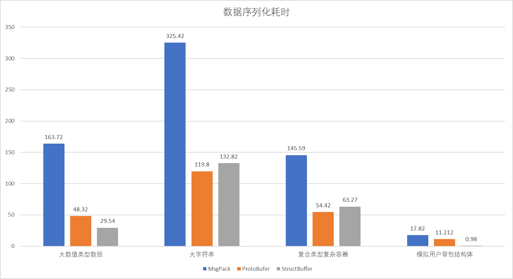
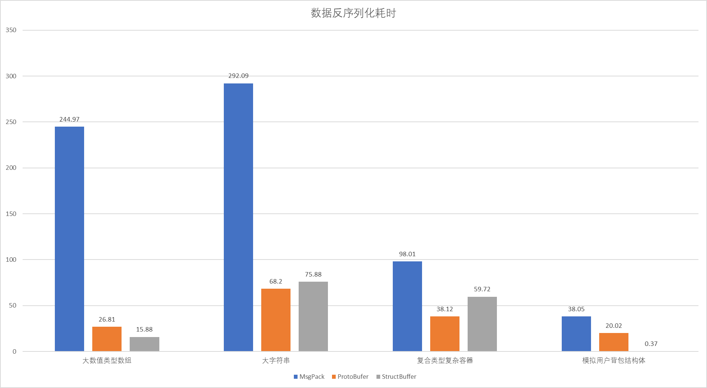

# StructBuffer

## Overview

​`StructBuffer`​是专注于降低接入成本和提高运行效率的C++序列化和反序列化库，追求在不跨平台、不跨语言场景下的最简化接口设计和最低开销，避免数据编解码成为系统性能瓶颈。

**advantages**：

* 纯C++头文件实现，无需任何代码生成和二次编译步骤，对于标准库容器和聚合的自定义类型可以做到完全非侵入，开箱即用，使用成本极低。
* 高性能，在特定场景下对比`ProtoBuffer`​和`MsgPack`​有几倍的性能提升。
* 二进制编码，且编码得到的字符串不包含任何自解释信息，一定程度上提高了安全性。
* 支持序列化多种标准库容器和自定义类型，对于自定义类型可以自由添加成员函数、使用模板等C++特性。

‍

## How to Use

* 本项目为header-only实现，且不依赖任何其他第三方库，直接在代码中`#include "StructBuffer/struct_buffer.hpp"`​即可使用
* C++语言标准：C++20。开发和测试使用的编译器版本为gcc13.2。理论上使用gcc10及以上的版本即可编译，参考https://en.cppreference.com/w/cpp/compiler_support/20

‍

## Examples

* 首先定义所有需要序列化的类型，也可以直接序列化合法的标准库类型
目前已支持的非自定义类型：
* 全部数值类型（不同位数的整型、无符号整型、浮点型等）
* std::string
* std::vector
* std::tuple

```c++
// struct_deines.hpp
#pragma once
#include "../struct_buffer.hpp"
#include <tuple>

/**
 * @brief: 符合std::aggregate_v的自定义类型可以直接序列化，不需要任何额外操作
*/
struct SimpleStruct
{
    // 可以在数据类中自由添加任何成员函数,不会影响数据序列化,e.g:
    bool operator==(const SimpleStruct&) const  = default;
    double avg() {
        return double_member / int_member;
    }

    int32_t int_member = 0;
    double double_member = 0.0;
    std::string str_member;
};

struct ComplicatedStruct
{
    bool operator==(const ComplicatedStruct&) const  = default;
    std::vector<int32_t> int_vec;
    std::vector<std::string> str_vec;
    std::vector<SimpleStruct> struct_vec;
    std::tuple<double, SimpleStruct, std::tuple<float>> complicated_tuple;
};

template <typename... Args>
struct TemplatedNestedStruct
{
    bool operator==(const TemplatedNestedStruct&) const  = default;
    SimpleStruct simple_struct;
    ComplicatedStruct complicated_struct;
    std::tuple<Args...> templated_data;
};

/**
 * 进阶操作：对于非aggregate类型（比如存在私有变量或者自定义构造函数等）的类，需要使用DEFINE_STRUCT_BUFFER_MEMBERS注册所有成员
*/
struct NonAggregateStruct
{
private:
    int int_member = 0;
    double double_member = 0.0;

public:
    NonAggregateStruct() = default;
    NonAggregateStruct(int i, double d): int_member(i), double_member(d) {}
    bool operator==(const NonAggregateStruct&) const  = default;
    DEFINE_STRUCT_BUFFER_MEMBERS(int_member, double_member);
};


```

* 在源文件中测试序列化和反序列化：

```c++
// main.cpp
#include "struct_defines.hpp"
#include <cassert>

// g++ example.cpp -g --std=c++2b

/**
 * @brief: 传入任意一个对象，对其进行序列化和反序列化操作，并检查数据是否一致
*/
void TestOneStruct(auto& origin_obj) {
    std::string serialized_str = structbuf::serializer::SaveToString(origin_obj);
    std::decay_t<decltype(origin_obj)> dest_obj;
    structbuf::deserializer::ParseFromSV(dest_obj, serialized_str);
    assert (dest_obj == origin_obj);
}

int main() {
    // 可以直接序列化标准库容器对象
    std::vector<std::string> std_vec {"he", "llo", "wor", "ld"};
    TestOneStruct(std_vec);

    // 序列化自定义类型
    SimpleStruct simple {42, 3.14};
    TestOneStruct(simple);

    ComplicatedStruct complicated {{1,2,3}, {"hello","world"}, {simple,simple,simple}, {1.23,simple,{4.56}}};
    TestOneStruct(complicated);

    TemplatedNestedStruct<int, int> templated {simple, complicated, {8,8}};
    TestOneStruct(templated);

    // 序列化非aggregate的类型
    NonAggregateStruct non_aggregate(1, 2.0);
    TestOneStruct(non_aggregate);
    return 0;
}
```

‍

## Benchmark

项目构造了多种典型的数据序列化场景，并与`ProtoBuffer`​和`MsgPack`​进行了性能对比测试，具体代码见`StructBuffer/benchmark`​，测试结果如下：（单位：ms）（编译环境：gcc13.2, -O2）

p.s. 模拟用户背包的结构体构造了游戏开发中序列化用户背包的场景，其定义如下

```c++
	struct Item
    {
        int32_t uuid = 0;
        int32_t cnt = 0;
        int32_t ext = 0;
    };

    // 模拟游戏开发中拉取玩家背包的数据包
    struct GetBagInfoRsp
    {
        int32_t retcode = 0;
        std::vector<Item> item_list;
    };
```

* 数据序列化耗时

  ||大数值类型数组|大字符串|复合类型复杂容器|模拟用户背包结构体|
  | --------------| ----------------| ----------| ------------------| --------------------|
  |MsgPack|163.72|325.42|145.59|17.82|
  |ProtoBufer|48.32|119.8|54.42|11.212|
  |StructBuffer|29.54|132.82|63.27|0.98|

​​

* 数据反序列化耗时

  ||大数值类型数组|大字符串|复合类型复杂容器|模拟用户背包结构体|
  | --------------| ----------------| ----------| ------------------| --------------------|
  |MsgPack|244.97|292.09|98.01|38.05|
  |ProtoBufer|26.81|68.2|38.12|20.02|
  |StructBuffer|15.88|75.88|59.72|0.37|

​​

‍

## 原理
[StructBuffer原理](./doc/doc.md)

